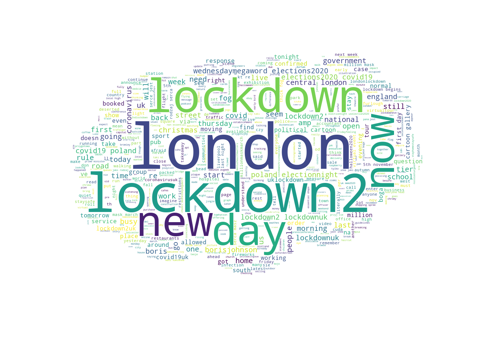

# Sentiment Analysis using NLP

## 📌 Internship Details

**Company:** CODTECH IT SOLUTIONS
**Name:** DEVIREDDY VENKATA UPENDRA REDDY
**Intern ID:** CMJI1L0Q10
**Domain:** DATA ANALYSIS
**Duration:** 3 MONTHS
**Mentor:** NEELA SANTOSH

---

## 📌 Overview

This project focuses on performing sentiment analysis on textual data using Natural Language Processing (NLP) techniques. The goal is to classify text into positive, negative, or neutral sentiments.

The project includes data preprocessing, feature extraction, model training, and visualization using word clouds.

---

## 🎯 Objective

To build a sentiment analysis model that can accurately classify text data and extract meaningful insights.

---

## 🧩 Key Areas Covered

• Text preprocessing (cleaning, stopword removal)
• Tokenization
• Feature extraction (TF-IDF / CountVectorizer)
• Model training and prediction
• Visualization using WordCloud

---

## 📊 Dataset

The dataset contains textual data such as reviews/tweets used for sentiment classification.

---

## 🤖 Model Used

• Naive Bayes
• Logistic Regression (optional)

---

## 📈 Analysis Performed

• Text preprocessing
• Feature extraction
• Model training and testing
• Sentiment prediction

---

## 🔍 Key Insights

• Frequent words indicate common public opinions
• Sentiment distribution helps understand user feedback
• WordCloud highlights dominant terms in dataset

---

## 🛠 Tools & Technologies

• Python
• NLP (Natural Language Processing)
• Scikit-learn
• NLTK
• WordCloud
• Matplotlib

---

## 📂 Files Included

• SentimentAnalysis.ipynb – Main notebook
• SentimentAnalysis-checkpoint.ipynb – Backup notebook
• images/ – Visualization outputs (wordcloud, etc.)
• README.md

---

## 🖼️ Output Visualizations

### Word Cloud

(Add your image in GitHub and keep same name)

Example:

---

## 🚀 How to Use

1. Install dependencies
   pip install pandas numpy scikit-learn nltk wordcloud matplotlib

2. Open notebook
   jupyter notebook SentimentAnalysis.ipynb

3. Run all cells

---

## 💡 Learning Outcome

• NLP preprocessing techniques
• Text classification methods
• Feature extraction techniques
• Data visualization using word cloud

---

## 📌 Conclusion

This project demonstrates how NLP techniques can be used to analyze text data and extract sentiment insights effectively.

---

## 👤 Author

B.Tech CSE (AI) Student

